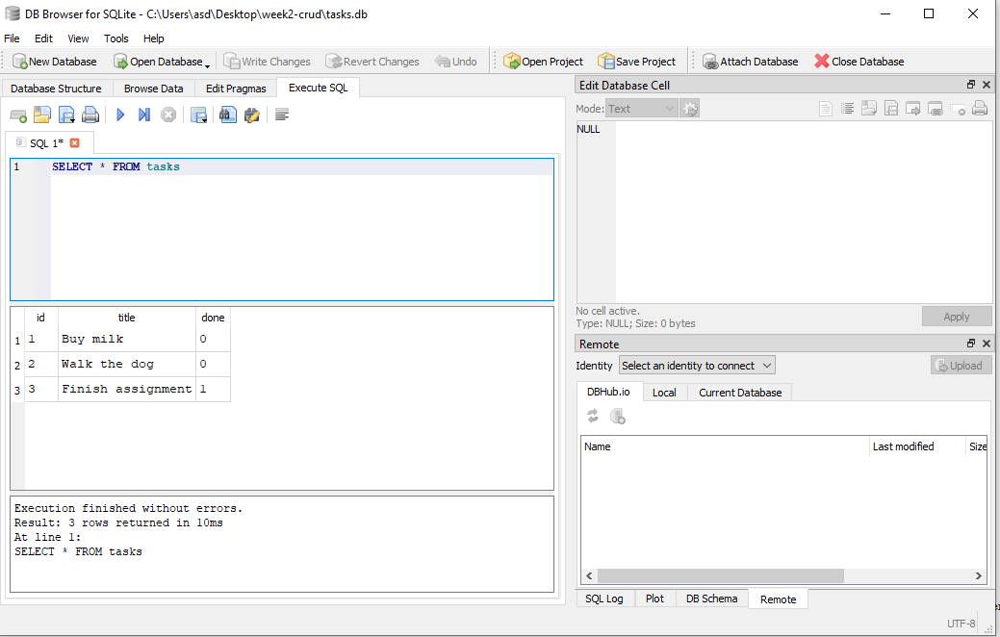
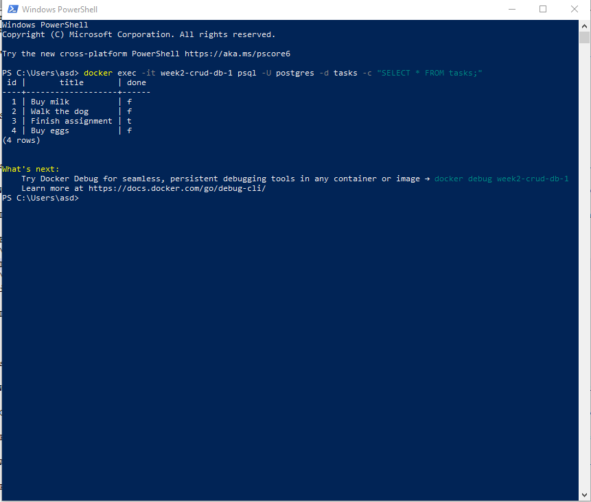
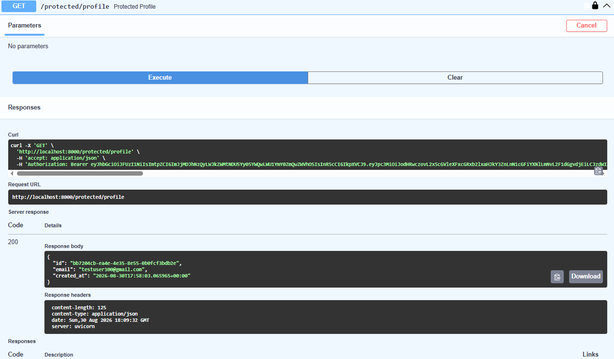
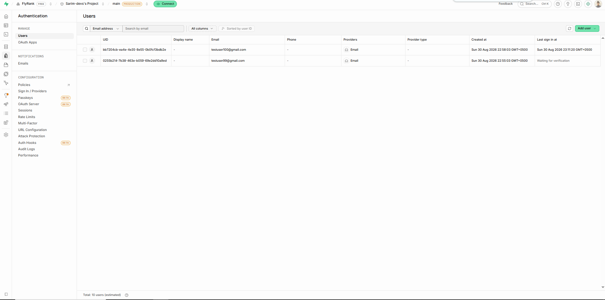

# Task CRUD API

A small CRUD API for managing tasks, built with FastAPI. Stores tasks in memory (no database yet).

## How to run

1. Create a virtual environment: `python -m venv venv`
2. Activate it: `venv\Scripts\activate`
3. Install dependencies: `pip install fastapi uvicorn`
4. Run the server: `uvicorn main:app --reload`
5. Visit `http://127.0.0.1:8000/docs` for interactive API docs

## Endpoints

| Method | Path | Description |
|--------|------|-------------|
| GET | / | API info |
| GET | /health | Health check |
| GET | /tasks | List all tasks |
| GET | /tasks/{id} | Get one task |
| POST | /tasks | Create a task |
| PUT | /tasks/{id} | Update a task |
| DELETE | /tasks/{id} | Delete a task |

## Example request


curl -i http://127.0.0.1:8000/tasks

Response:

HTTP/1.1 200 OK
date: Sat, 29 Aug 2026 20:22:20 GMT
server: uvicorn
content-length: 125
content-type: application/json

[{"id":1,"title":"Buy milk","done":0},{"id":2,"title":"Walk the dog","done":0},{"id":3,"title":"Finish assignment","done":1}]


## Swagger UI


## Database (Week 3)

Tasks are now stored in a SQLite database (`tasks.db`) instead of memory. Data survives server restarts.

**Why SQLite:** no separate server to install, the whole database is one file, perfect for a small project like this.

**Database file:** `tasks.db`, created automatically on first run. The `tasks` table is created if missing, and 3 example tasks are seeded only if the table is empty (so restarting never duplicates them).

**Example SQL query:**
\`\`\`sql
SELECT * FROM tasks WHERE done = 1;
\`\`\`
This returns only the tasks marked as completed.



## Database (Week 4 — Postgres in Docker)

Tasks are now stored in **PostgreSQL**, running in a Docker container, instead of SQLite. The whole stack (API + database) starts with one command: `docker compose up`.

**Why Postgres in Docker:** SQLite was a single file — fine for one developer, but not how real backends run. Postgres runs as its own server, the same kind of database that powers production systems. Docker means anyone can run the exact same database, with zero manual installation.

**Connection:** the app reads `DATABASE_URL` from `.env` (a `.env.example` is committed with placeholder values). Inside Docker's network, the app reaches the database by its service name (`db`), not `localhost`.

**Persistence proven:** created a task, ran `docker compose down` then `docker compose up` — the task was still there. The named Docker volume (`taskdata`) keeps the data outside the container's lifecycle.

**Architecture:** all database logic lives in `database.py` (a repository layer) — the routes in `main.py` never changed when the storage swapped from SQLite to Postgres. That's the whole point of the pattern.



## Auth (Week 4 — Supabase Auth & Protected Routes)

This week adds real user authentication using **Supabase Auth** as the Identity Provider. The app never stores passwords or hashes anything itself — Supabase handles account creation, password hashing, and signing JWTs.

**Auth endpoints:**

| Method | Path | Auth required | Description |
|--------|------|----------------|-------------|
| POST | /auth/signup | none | Create a new user account |
| POST | /auth/login | none | Log in, returns access + refresh token |
| POST | /auth/logout | Bearer token | End the session |
| GET | /protected/profile | Bearer token | Read the logged-in user's profile |
| GET | /protected/dashboard | Bearer token | Second example of a protected route |
| GET | /public/info | none | Open, unauthenticated data |

**How it works:** the client signs up or logs in against Supabase directly (via this API), receives a JWT access token, and sends it in the `Authorization: Bearer <token>` header on every protected request. The server verifies the token with Supabase (`supabase.auth.get_user()`) before allowing access — an invalid, expired, or missing token returns `401`.

**Middleware:** all token verification lives in one reusable dependency (`verify_token`), applied to every protected route via FastAPI's `Depends()`. Adding a new protected route requires zero new auth code.

**Swagger UI:** protected routes show a padlock icon at `/docs`. Click "Authorize," paste a valid access token, and test protected routes directly from the browser.



**Setup:** requires a free Supabase project. Copy `SUPABASE_URL` and `SUPABASE_KEY` (the anon key, never the service_role key) into `.env` — see `.env.example`.

**Example request:**

```bash
curl -i -X POST http://localhost:8000/auth/login \
  -H "Content-Type: application/json" \
  -d '{"email":"testuser100@gmail.com","password":"password123"}'
```

**Response:**

```
HTTP/1.1 200 OK
content-type: application/json

{"access_token":"eyJhbGciOiJFUzI1NiIs...(truncated)","refresh_token":"4m5maegyc45e"}
```

